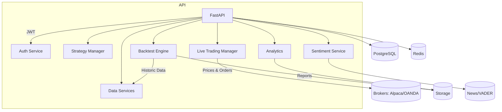

# AlgoForge Trading Engine

AlgoForge is a production-ready algorithmic trading platform targeting equities and forex.
It bundles strategy authoring, backtesting, live trading, analytics, and sentiment insights.

## Quickstart

```bash
cp .env.example .env
make install
make up
# wait for services to become healthy, then:
curl http://localhost:8000/healthz
```

### Useful Commands

- `make fmt` – format with black
- `make lint` – run ruff linting
- `make typecheck` – static type analysis with mypy
- `make test` – run pytest suite
- `make migrate` – apply alembic migrations
- `make seed` – seed sample strategies into the database
- `make down` – stop docker stack

### Environment Variables

The `.env.example` file lists required configuration. Copy it to `.env` and fill in secrets.

### Sample Flow

```bash
# Register user
curl -X POST http://localhost:8000/auth/register -H 'Content-Type: application/json' \
  -d '{"email":"trader@example.com","password":"ChangeMe123","role":"admin"}'

# Login to receive tokens
TOKEN=$(curl -s -X POST http://localhost:8000/auth/login -H 'Content-Type: application/json' \
  -d '{"email":"trader@example.com","password":"ChangeMe123"}' | jq -r '.access_token')

# Create SMA crossover strategy
curl -X POST http://localhost:8000/strategies -H "Authorization: Bearer $TOKEN" \
  -H 'Content-Type: application/json' \
  -d '{"name":"SMA Crossover","assets":["AAPL"],"timeframe":"1d","params":{"fast":20,"slow":50},"code":"from engine import indicators\nclass Strategy(StrategyBase):\n    def next(self):\n        pass"}'

# Run backtest
curl -X POST http://localhost:8000/backtests/run -H "Authorization: Bearer $TOKEN" \
  -H 'Content-Type: application/json' \
  -d '{"strategy_id":1,"start":"2022-01-01","end":"2023-01-01","initial_cash":100000}'
```

### Architecture



### Security

- Strategies execute inside a sandbox with a limited API and no filesystem/network access.
- API credentials are encrypted with Fernet using a key stored in environment settings.
- Secrets are never logged and JWT tokens are rotated on refresh.

### Disclaimer

This software is for educational purposes. Trading carries risk; no warranty is provided.

